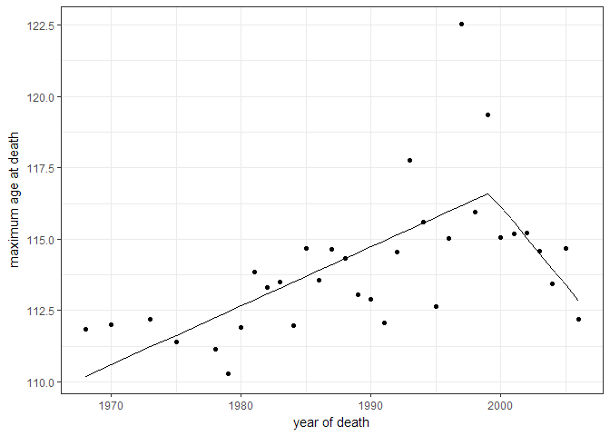

# An Analysis Of: "Evidence for a limit to human lifespan"
Neil Saunders with a section by Pedro J. Aphalo  
14/12/2016  


## Introduction
This is a quick assessment of the data from [Evidence for a limit to human lifespan](http://www.nature.com/nature/journal/v538/n7624/full/nature19793.html). It has been discussed previously in the NRC articles [Nature article is wrong about 115 year limit on human lifespan](https://www.nrc.nl/nieuws/2016/10/07/human-lifespan-limited-to-115-years-a1525476) and [Statistical problems, but not enough to warrant a rejection](https://www.nrc.nl/nieuws/2016/12/09/statistical-problems-but-not-enough-to-warrant-a-rejection-a1535908).

This document indicates how to retrieve the data used in the _Nature_ paper for your own analysis. However, you're probably wasting your time since Berens & Wallis already did a great job. It is [described here](http://www.askaswiss.com/2016/11/is-there-really-evidence-for-limit-to-human-lifespan.html) and [wonderfully-documented here](https://github.com/philippberens/lifespan).

## Getting the data
### IDL Data
You can easily get data from the [International Database on Longevity](http://www.supercentenarians.org/Home/Expand_IDL) by creating an account, logging in and downloading their CSV files for each country. You could also automate the process using _e.g. rvest_ if desired. 

```r
# create an account at the International Database on Longevity then login at
# http://www.supercentenarians.org/User/Login and download all of their CSV
# files
files <- list.files("../../data", pattern = "*.csv", full.names = TRUE)
l1 <- lapply(files, function(x) read.csv(x, sep = ";", header = TRUE, stringsAsFactors = FALSE))
idl <- do.call(rbind, l1)

# format the dates this returns NA for those with year only (e.g. USA)
idl$dob <- dmy(idl$Date.of.birth)
idl$dod <- dmy(idl$Date.of.death)

# get years from dates
get_year <- function(d) {
    y <- NA
    if (nchar(d) == 4) {
        y <- as.numeric(d)
    } else if (nchar(d) == 10) {
        y <- as.numeric(substr(d, 7, 10))
    }
    return(y)
}

# add year of birth, death columns
idl$yob <- sapply(idl$Date.of.birth, get_year)
idl$yod <- sapply(idl$Date.of.death, get_year)
```

### GRG Data
Data from the [Gerentology Research Group](http://www.grg.org/) is a little harder to process, since we have to web-scrape some cleverly-hidden URLs.

```r
format_date <- function(d) {
    asdate <- NA
    d.split <- strsplit(d, " ")
    if (length(d.split[[1]]) == 3) {
        mon <- substr(d.split[[1]][1], 1, 3)
        day <- gsub(",", "", d.split[[1]][2])
        yr <- d.split[[1]][3]
        asdate <- paste(yr, mon, day, sep = "-")
    }
    return(asdate)
}

grg_url <- "http://www.grg.org/Adams/A_files/sheet001.htm"
grg <- readHTMLTable(grg_url, stringsAsFactors = FALSE)
grg <- grg[[1]][12:nrow(grg[[1]]), ]
colnames(grg) <- grg[1, ]
grg <- grg[2:(nrow(grg) - 10), ]

# format the dates
grg$dob <- sapply(grg$Born, format_date)
grg$dob <- ymd(grg$dob)
grg$dod <- sapply(grg$Died, format_date)
grg$dod <- ymd(grg$dod)
```

## Processing the data
IDL n = 668. The _Nature_ paper states that n = 534. We get there by using data only where country of death was France, Great Britain, Japan or the USA. We get the data used for figure 2a of the paper by aggregating the data to give us the maximum age at death (in days) for each year. This is the variable maximum reported age at death and n = 33.


```r
idl4 <- idl[idl$Country.of.death %in% c("FRA", "GBR", "JPN", "USA"), ]
idl4.max <- aggregate(Age.days. ~ yod, idl4, max)
```

## Modelling
### Linear regression
The simplest linear regression.

```r
idl4.lm <- lm(Age.days. ~ yod, idl4.max)
glance(idl4.lm)
```

```
##   r.squared adj.r.squared    sigma statistic     p.value df    logLik
## 1 0.2777109     0.2544113 769.2955   11.9191 0.001627574  2 -265.0941
##        AIC      BIC deviance df.residual
## 1 536.1881 540.6777 18346280          31
```

```r
ggplot(idl4.lm) + geom_line(aes(yod, .fitted/365)) + theme_bw() + geom_point(aes(yod, 
    Age.days./365)) + labs(x = "year of death", y = "maximum age at death")
```

<!-- -->

### Linear regression with breakpoints
We use the _segmented_ package to model linear regression with breakpoints. 

```r
idl4.sm <- segmented(idl4.lm, ~yod)
glance(idl4.sm)
```

```
##   r.squared adj.r.squared    sigma statistic      p.value df    logLik
## 1 0.4780415     0.4240458 676.1413  8.853326 0.0002536047  4 -259.7342
##        AIC     BIC deviance df.residual
## 1 529.4685 536.951 13257844          29
```

```r
ggplot(idl4.sm) + geom_line(aes(yod, .fitted/365)) + theme_bw() + geom_point(aes(yod, 
    Age.days./365)) + labs(x = "year of death", y = "maximum age at death")
```

<!-- -->

For comparison, here is the complete n = 668 dataset with the default LOESS smoothing fitted by _geom\_smooth_. Note that the confidence interval around the later values allows for a slight upward trend.


```r
ggplot(idl) + theme_bw() + geom_point(aes(yod, Age.days./365)) + labs(x = "year of death", 
    y = "maximum age at death") + geom_smooth(aes(yod, Age.days./365))
```

<!-- -->

## Conclusions
* It is possible to model the IDL data using piecewise regression
* However, in contrast to the paper, the breakpoint is early 1999 (not 1995), standard error ~ 2.2 years
* Agree with previous analysis that the segmented model is not superior to a basic linear model

# Including countries as random effect (P. J. A., 2016-12-18)

Surprisingly the different analyses have overlooked the fact the time series for the different countries cover diferent ranges of years, while at the same time difering in their overall means. Not including countries in the analysis can be, from first principles, expected to cause bias and distort the apparent shape of the response.


```r
idl4.max.country <- aggregate(Age.days. ~ yod * Country.of.death, idl4, max)
idl4.max.country$yod2k <- idl4.max.country$yod - 2000
idl4.max.country$Country.of.death <- factor(idl4.max.country$Country.of.death)
```


```r
summary(idl4.max.country)
```

```
##       yod       Country.of.death   Age.days.         yod2k        
##  Min.   :1968   FRA:14           Min.   :40203   Min.   :-32.000  
##  1st Qu.:1987   GBR:29           1st Qu.:40865   1st Qu.:-13.000  
##  Median :1995   JPN:10           Median :41224   Median : -5.000  
##  Mean   :1993   USA:24           Mean   :41314   Mean   : -7.286  
##  3rd Qu.:2000                    3rd Qu.:41730   3rd Qu.:  0.000  
##  Max.   :2006                    Max.   :44724   Max.   :  6.000
```

A simple plot with lines fitted by country suggests that there is continued increase in age at death.


```r
ggplot(idl4.max.country, aes(yod, Age.days./365, color = Country.of.death)) + 
    theme_bw() + geom_point() + labs(x = "year of death", y = "maximum age at death") + 
    geom_smooth(method = lm)
```

<!-- -->

Fitting a mixed effects model shows a clear aoutlier


```r
idl4a.lme <- lme(Age.days. ~ yod2k, random = ~1 | Country.of.death, data = idl4.max.country)
idl4b.lme <- lme(Age.days. ~ yod2k, random = ~1 | Country.of.death, data = idl4.max.country, 
    weights = varPower())
anova(idl4a.lme, idl4b.lme)
```

```
##           Model df      AIC      BIC    logLik   Test  L.Ratio p-value
## idl4a.lme     1  4 1212.726 1221.996 -602.3632                        
## idl4b.lme     2  5 1212.604 1224.192 -601.3022 1 vs 2 2.122085  0.1452
```


```r
plot(idl4a.lme)
```

<!-- -->

```r
plot(idl4a.lme, resid(., type = "p") ~ yod)
```

<!-- -->

```r
anova(idl4a.lme)
```

```
##             numDF denDF  F-value p-value
## (Intercept)     1    72 76996.50  <.0001
## yod2k           1    72    11.14  0.0013
```

```r
summary(idl4a.lme)
```

```
## Linear mixed-effects model fit by REML
##  Data: idl4.max.country 
##        AIC      BIC    logLik
##   1212.726 1221.996 -602.3632
## 
## Random effects:
##  Formula: ~1 | Country.of.death
##         (Intercept) Residual
## StdDev:     250.326 666.2993
## 
## Fixed effects: Age.days. ~ yod2k 
##                Value Std.Error DF   t-value p-value
## (Intercept) 41516.43 159.43162 72 260.40273  0.0000
## yod2k          30.93   9.26591 72   3.33817  0.0013
##  Correlation: 
##       (Intr)
## yod2k 0.357 
## 
## Standardized Within-Group Residuals:
##         Min          Q1         Med          Q3         Max 
## -1.60959067 -0.69044760 -0.04664659  0.45347600  5.06094780 
## 
## Number of Observations: 77
## Number of Groups: 4
```

```r
glance(idl4a.lme)
```

```
##      sigma    logLik      AIC      BIC deviance
## 1 666.2993 -602.3632 1212.726 1221.996       NA
```


```r
idle.aug <- augment(idl4a.lme, idl4.max.country)
names(idle.aug)
```

```
## [1] "yod"              "Country.of.death" "Age.days."       
## [4] "yod2k"            ".fitted"          ".resid"          
## [7] ".fixed"
```

Plotting the fitted values and original data by country, shows clearly the problem of the different lengths of series.


```r
ggplot(idle.aug, aes(yod, Age.days./365, color = Country.of.death)) + geom_point() + 
    geom_line(aes(y = .fitted/365))
```

<!-- -->

The residuals plotted vs. year of death do not suggest any drastic change in slope around 1990-2000.


```r
ggplot(idle.aug, aes(yod, .resid/365, color = Country.of.death)) + geom_point() + 
    geom_smooth(method = lm)
```

<!-- -->

We fit a curvilinear model to test for evidence of curvature.


```r
idl4a2.lme <- lme(Age.days. ~ poly(yod2k, degree = 2), random = ~1 | Country.of.death, 
    data = idl4.max.country)
idl4b2.lme <- lme(Age.days. ~ poly(yod2k, degree = 2), random = ~1 | Country.of.death, 
    data = idl4.max.country, weights = varPower())
anova(idl4a2.lme, idl4b2.lme)
```

```
##            Model df      AIC      BIC    logLik   Test  L.Ratio p-value
## idl4a2.lme     1  5 1190.975 1202.495 -590.4873                        
## idl4b2.lme     2  6 1191.317 1205.141 -589.6586 1 vs 2 1.657485  0.1979
```

We see no evidence for curvature.


```r
anova(update(idl4a.lme, method = "ML"), update(idl4a2.lme, method = "ML"))
```

```
##                                   Model df      AIC      BIC    logLik
## update(idl4a.lme, method = "ML")      1  4 1230.692 1240.068 -611.3462
## update(idl4a2.lme, method = "ML")     2  5 1232.620 1244.339 -611.3101
##                                     Test    L.Ratio p-value
## update(idl4a.lme, method = "ML")                           
## update(idl4a2.lme, method = "ML") 1 vs 2 0.07213557  0.7883
```

Anyway we plot as before, and the very slight and non-significant curvature in the second degree polynomial is upwards.


```r
plot(idl4a2.lme)
```

<!-- -->

```r
plot(idl4a2.lme, resid(., type = "p") ~ yod)
```

<!-- -->

```r
anova(idl4a2.lme)
```

```
##                         numDF denDF  F-value p-value
## (Intercept)                 1    71 71917.61  <.0001
## poly(yod2k, degree = 2)     2    71     5.59  0.0056
```

```r
summary(idl4a2.lme)
```

```
## Linear mixed-effects model fit by REML
##  Data: idl4.max.country 
##        AIC      BIC    logLik
##   1190.975 1202.495 -590.4873
## 
## Random effects:
##  Formula: ~1 | Country.of.death
##         (Intercept) Residual
## StdDev:    261.9223 669.4846
## 
## Fixed effects: Age.days. ~ poly(yod2k, degree = 2) 
##                             Value Std.Error DF   t-value p-value
## (Intercept)              41289.89  154.4954 71 267.25636  0.0000
## poly(yod2k, degree = 2)1  2393.56  719.9607 71   3.32457  0.0014
## poly(yod2k, degree = 2)2   248.80  701.3200 71   0.35476  0.7238
##  Correlation: 
##                          (Intr) p(2,d=2)1
## poly(yod2k, degree = 2)1 -0.071          
## poly(yod2k, degree = 2)2 -0.007  0.001   
## 
## Standardized Within-Group Residuals:
##         Min          Q1         Med          Q3         Max 
## -1.56195577 -0.64612806 -0.02723809  0.43075367  5.04771976 
## 
## Number of Observations: 77
## Number of Groups: 4
```

```r
glance(idl4a2.lme)
```

```
##      sigma    logLik      AIC      BIC deviance
## 1 669.4846 -590.4873 1190.975 1202.495       NA
```


```r
idle2.aug <- augment(idl4a2.lme, idl4.max.country)
names(idle2.aug)
```

```
## [1] "yod"              "Country.of.death" "Age.days."       
## [4] "yod2k"            ".fitted"          ".resid"          
## [7] ".fixed"
```

```r
ggplot(idle2.aug, aes(yod, Age.days./365, color = Country.of.death)) + geom_point() + 
    geom_line(aes(y = .fitted/365))
```

<!-- -->

There is one additional problem, that the size of the statistical population sampled has increased over the years, and consequently the expected value for the maximum age at death must have increased due to this alone.
